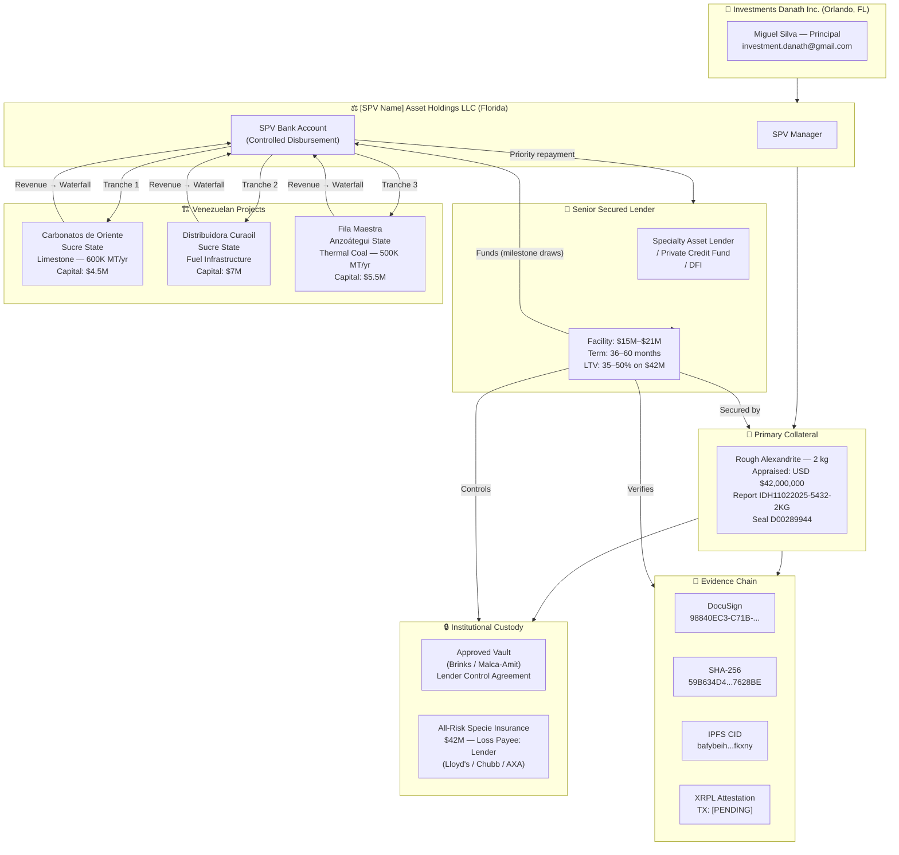

# PORTFOLIO OVERVIEW DIAGRAM

**Purpose:** End-to-end portfolio structure in Mermaid flowchart  
**Scope:** All four assets, legal structure, evidence chain

---

## Portfolio Quick Reference

| | Alexandrite | Carbonatos | Curaoil | Fila Maestra |
|-|-------------|-----------|---------|-------------|
| **Type** | Gemstone RWA | Limestone Mine | Fuel Infrastructure | Coal Mine |
| **Location** | Bahia, Brazil (custody: USA) | Sucre, Venezuela | Sucre, Venezuela | Anzoátegui, Venezuela |
| **Value / Capacity** | $42M appraised | 600K MT/yr | 12.5 Ha facility | 500K MT/yr |
| **Capital Needed** | (is collateral) | $4.5M | $7.0M | $5.5M |
| **Role in Facility** | Primary collateral | Secondary / revenue | Secondary / revenue | Secondary / revenue |
| **Year 2 EBITDA** | — | $3.4M | $1.2M | $5.2M |
