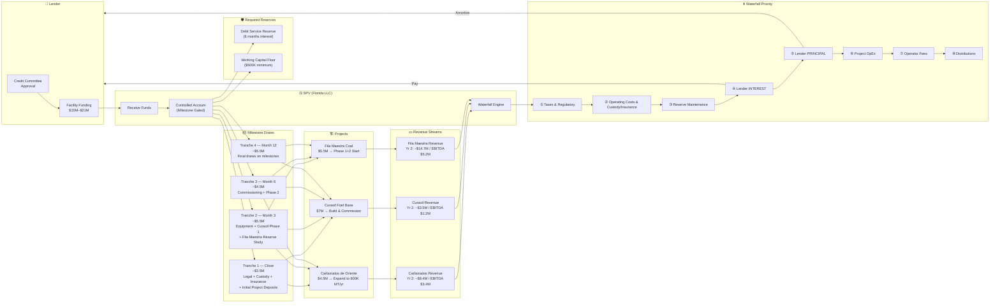

# FUND FLOW DIAGRAM

**Purpose:** Money flow from lender through facility to projects and waterfall repayment  
**Framework:** Senior secured credit facility — milestone disbursements + waterfall repayment

---

## Repayment Math (Base Case — $19M Facility)

| Year | Portfolio EBITDA | Debt Service | DSCR | Cumulative Repaid |
|------|-----------------|-------------|------|------------------|
| Year 1 (ramp) | $2.5M | $1.5M (interest only) | 1.67x | $1.5M |
| Year 2 | $9.7M | $4.9M | 1.98x | $6.4M |
| Year 3 | $12.8M | $4.9M | 2.61x | $11.3M |
| Year 4 | $14.5M | $4.9M | 2.96x | $16.2M |
| Year 5 | $15.0M | $4.9M | 3.06x | $21.1M → **Paid off** |

*At 8% interest, 5-year term with 12-month interest-only period, $19M principal.*
