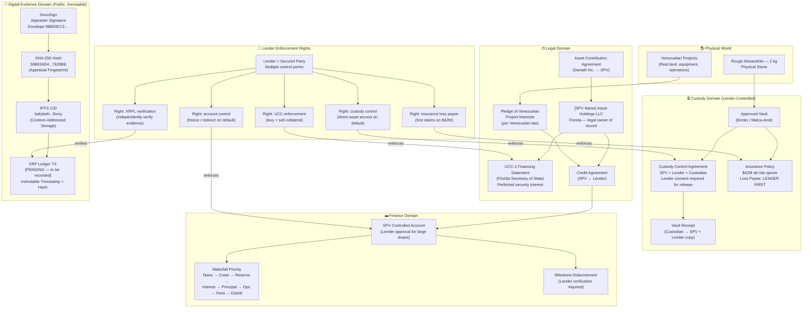

# TRUST BOUNDARIES DIAGRAM

**Purpose:** Legal, custody, XRPL, and finance domain boundaries  
**Context:** Shows which entity controls what, and where lender protections are enforced



---

## Domain Summary Table

| Domain | Who Controls | What Happens on Default |
|--------|-------------|----------------------|
| **Physical Custody** | Custodian (under Lender control agreement) | Lender takes direct custody control |
| **Insurance** | Insurer / Insurance Broker | Lender collects insurance proceeds as loss payee |
| **Legal (SPV + UCC)** | Lender (via UCC-1 security interest) | Lender enforces security interest; may sell collateral |
| **Venezuelan Projects** | SPV / operator under Venezuelan law | Pledge of interests enforced per Venezuelan law |
| **Digital Evidence** | Public / immutable (no one controls) | Lender independently verifies — cannot be manipulated by either party |
| **Finance / Accounts** | SPV Manager + Lender approval | Lender freezes / redirects account per security agreement |

---

## Why This Structure Is Lender-Safe

```
Before Default:          After Default:
─────────────          ──────────────
SPV manages ops        Lender controls:
Operator runs          → Custody (asset)
  projects             → Insurance (cash)
Lender monitors        → UCC (title)
  + receives           → Account (funds)
  payments             → Can sell all
```

The lender has **five independent enforcement paths** — if any one fails, the others remain. This is belt-and-suspenders design.
